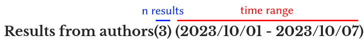

<h1>"LiRA: Literature Review Automated"</h1>

> :mortar_board: Automate your weekly scientific literature review
  
**LiRA** is a CLI Python program based on PyMed and SerpAPI to search on PubMed and get the results programmatically in a readable HTML page.

I created LiRA mainly for myself, but feel free to use it if you find it useful.

## Documentation
All you need is on this README!

- [Install](https://github.com/fpradelli94/LiRA#install-linux)
- [Configuration](https://github.com/fpradelli94/LiRA#configuration-required)
- [Usage](https://github.com/fpradelli94/LiRA#usage)
- [Need `--help`?](https://github.com/fpradelli94/LiRA#need---help)
- [Release history](https://github.com/fpradelli94/LiRA#release-history)
- [Future developments](https://github.com/fpradelli94/LiRA#future-developments)
- [Known problems](https://github.com/fpradelli94/LiRA#known-problems)
- [Meta](https://github.com/fpradelli94/LiRA#meta)
- [Contributing](https://github.com/fpradelli94/LiRA#contributing)
  
## Install [Linux]

*Notice*: I provided instructions to install and use LiRA with `pipenv`, but you can use any virtual environment 
manager such as Conda or Venv.

### Linux
> :warning: LiRA currently requires Pyhon 3.8 to run. If you don't have it in your system, consider using [Pyenv](https://github.com/pyenv/pyenv) for the installation.

If you don't have it, install [Pipenv](https://pipenv.pypa.io/en/latest/):
```shell
pip install pipenv --user
```
Clone this repository using `git`:
```shell
git clone https://github.com/fpradelli94/LiRA.git
```
Install the project requirements listed in `requirements.txt`:
```shell
cd LiRA
pipenv install -r requirements.txt
```

### MacOS
> :warning: LiRA currently requires Pyhon 3.8 to run. If you don't have it in your system, consider using [Pyenv](https://github.com/pyenv/pyenv) for the installation.

Make sure you have `pipenv` installed (else, install it with `brew install pipenv`):
```shell
> pipenv --version
pipenv, version 2024.4.1. # you should get something like this
```
Clone this repository using `git`:
```shell
git clone https://github.com/fpradelli94/LiRA.git
```
Go into the cloned folder:
```shell
cd LiRA
```
Use `pyenv` to ensure you locally have Python 3.8
```
pyenv install 3.8 
pyenv local 3.8
```
Use `pipenv` to set up a virtual environment:
```shell
pipenv install --python 3.8 -r requirements.txt
```

## Configuration (required)
LiRA requires a configuration file in the `.json` format to work. You can find a template in `in/template_config`.

To generate the configuration file, simply type:
```shell
mkdir config
cp in/template_config.json config/config.json
```

This will generate an empty configuration file for LiRA. 

Start filling the `config.json` file with your email (necessary to do programatic searches on PubMed) and SerpAPI key (necessary to search on Google Scholar):
> SerpAPI is a third-party API to scrape Google Scholar. You can get your key for free [here](https://serpapi.com/)
```json
{
	"engines": ["pubmed", "google_scholar"],
	"email": "PLACE YOUR EMAIL HERE",
	"serpapi_key": "PLACE YOUR SEPAPI KEY HERE",
	"keywords": [],
	"authors": [],
	"journals": [],
	"highlight_authors": []
}
```

Then, you can add your keywords, authors, and journals of interest in the configuration file. For instance, a 
meaningful configuration file might look like this:
```json
{
   "engines": ["pubmed", "google_scholar"],
   "email": "example@gmail.com",
   "serpapi_key": "aobosandi392309qwjadosnasioiq"
   "keywords": [
            "Breast Cancer",
            "Omics",
            "cancer AND immunology"
        ],
   "authors": [
            "Kaelin, William",
            "Doudna, Jennifer"
        ],
   "journals": [
            "ArXiv",
            "bioRxiv",
            "Nature"
        ],
   "highlight_authors": [
            "Doe, John"
        ]
}
```
Where:
* `keywords` contains all the meaningful keywords you'd like to search;
* `authors` contains your authors of interest
* `journals` contains all the journals you want to look at;
* `highlight_authors` contains authors that LiRA will not actively search, but if any resulting publication contains 
one of these authors, its name will be highlighted in the output. (*Note*: I created this feature because I needed it, 
but I expect a few people will find it helpful. If that's your case, leave this field empty.).

## Usage
### Basic usage
Inside the folder containing the `lira.py` script, provide LiRA with the date you'd like to start searching:
```shell
pipenv run python3 lira.py --from-date 2023/09/19 
# OR
pipenv run python3 lira.py -d 2023/09/19
```
If everything works smoothly, you should see logging messages appearing. It means the LiRA is searching the papers 
from the given date to the day you are running LiRA.

At the end of the process, an HTML report should automatically open in your browser.

By default, the HTML report contains the following sections:
- **General results**: containing the publications matching the keywords specified in the `config.json` file from the
given date;
- **Results for [Journal]**: containing ALL the publications in the journal from the given date. A new section is 
generated for each journal in the `config.json`
- **Results for Authors**: containing ALL the publications for the authors specified in the `config.json` from the 
given date 

Moreover, each engine will have its own section. For instance, if you choose to scrape from Google Scholar and Pubmed, you might end up with two "General parts", one for Google Scholar and one for Pubmed.

### Using keywords to filter Journals and Authors papers
By default, LiRA will provide ALL the most recent publications from 
your journals and authors of interest. If you want to get only 
the results matching the keywords in the `config` file, just type:
```shell
pipenv run python3 lira.py -d 2023/09/19 --filter-journals  # for journals 
# OR
pipenv run python3 lira.py -d 2023/09/19 --filter-authors   # for authors
# OR
pipenv run python3 lira.py -d 2023/09/19 --filter-authors --filter-journals  # for both
```

### Suppressing sections
If you are just interested in having the most recent results from the journals and the authors, you can tell LiRA to 
not generate the 'General Results' section:
```shell
pipenv run python3 lira.py -d 2023/09/19 --suppress-general
```
If you are not interested in any specific author or journal, it is sufficient to keep the `authors` and `journals` 
sections empty in the `config.json` file:
```json
{
   "engines": ["pubmed", "google_scholar"],
   "email": "example@gmail.com",
   "serpapi_key": "aobosandi392309qwjadosnasioiq",
   "keywords": [
            "Breast Cancer",
            "Omics",
            "cancer AND immunology"
        ],
   "authors": [],
   "journals": [],
   "highlight_authors": []
}
```

### Reading the HTML report
For each section, the total number of results and the time range of the search is shown in the header:



### Using different configuration files
The `config.json` file contains the default configuration for LiRA. However, you can generate different configuration 
files and use them to run other searches. Just use the `-c` argument:
```shell
pipenv run lira.py -d 2023/09/19 -c another_config_file.json
```

### Accessing the HTML report
The output of  LIRA is stored in `out/lira_output.html`. You can open the most recent report anytime by accessing the 
file directly or running:
```shell
pipenv run python3 lira.py --last
# OR
pipenv run python3 lira.py -L
```

## Need `--help`?
For additional details on the use of LiRA, just type:
```shell
pipenv run lira.py --help
```
To access all the possible arguments and ways to automate your literature research!

## Release History  
  
* 09/10/2023: First release.
* 22/11/2023: Added experimental support to Google Scholar with SerpAPI.

## Future developments

* Automatic generation of Bibtex files

## Known problems
- PyMed is not always able to scrape the full abstract of a paper. You might find incomplete abstracts in the 
HTML report.
- I could not find a way to search for a specific author code on PubMed. Thus, the author names are searched "as they
are", and you might find papers from homonyms. To avoid homonyms, it is recommended to filter the authors using the 
keywords.
- Usually, the authors' names in the `config` file are highlighted in red in the HTML report. However, LiRA might fail 
sometimes due to unprecise character matching or middle names.
- SerpAPI is not able to retrive the full paper abastract, but only a "snippet". Thus, only a small part of the astract is displayed in LiRA.

## Meta
Franco Pradelli (franco.pradelli94@gmail.com)

## License
This work is licensed under the Creative Commons Attribution-NonCommercial 4.0 International License. To view a copy of 
this license, visit http://creativecommons.org/licenses/by-nc/4.0/ or send a letter to Creative Commons, PO Box 1866, 
Mountain View, CA 94042, USA.
  
## Contributing  
Thanks if you're considering to contribute to LiRA. I follow the standard "Fork & Pull" contributing model of GitHub 
(more information [here](https://docs.github.com/en/get-started/quickstart/contributing-to-projects)).

Briefly, if you'd like to make a change to LiRA you can:

1. create an account on GitHub 
2. fork this project 
3. make a local clone with `git clone`
4. make changes on the local copy 
5. commit changes git commit -a -m "my message"
6. push to your GitHub account with `git push origin`
7. create a Pull Request (PR) from your GitHub fork (go to your fork's webpage and click on "Pull Request."
You can then add a message to describe your proposal.)
